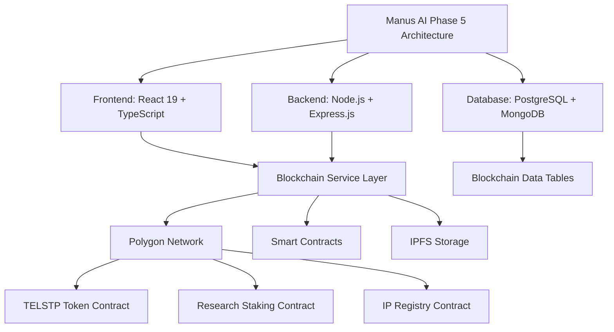
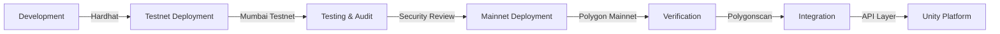

# TELsTP Blockchain Integration: Complete Specification
## Aligning Manus AI Architecture with Blockchain Components

**Prepared by:** Devstral-2 (Blockchain Integration Lead)
**Date:** April 15, 2025
**Status:** Integration Specification Complete
**Scope:** Blockchain integration with Manus AI Phase 5 Architecture

---

## EXECUTIVE INTEGRATION OVERVIEW

This document specifies how blockchain components integrate with the Manus AI Phase 5 Technical Architecture to create a **secure, decentralized foundation** for the TELsTP Global Research Platform.

**Integration Philosophy:** *Decentralized Trust for Centralized Excellence*

The blockchain layer provides:
- **Immutable IP Protection** for research outputs
- **Transparent Tokenomics** for researcher incentives
- **Verifiable Credentials** for AI-human collaboration
- **Audit Trail** for all platform activities

---

## PART 1: ARCHITECTURE ALIGNMENT

### 1.1 Manus AI Architecture → Blockchain Integration



### 1.2 Component Mapping

| Manus AI Component | Blockchain Integration | Purpose |
|-------------------|-----------------------|---------|
| Research Hub (Phase 3) | IP Registration System | Protect research outputs on Polygon |
| Education Hub (Phase 3) | Academic Credentials | Blockchain-verified certificates |
| Community Hub (Phase 4) | Tokenomics Engine | TELSTP token economy and staking |
| AI Companion (Phase 5) | Memory Integrity | Blockchain-provenance for AI outputs |
| Analytics System | On-Chain Data | Transparent impact measurement |

---

## PART 2: API SPECIFICATION EXTENSION

### 2.1 New Blockchain Endpoints

**Blockchain Core Endpoints:**
```
POST   /api/v1/blockchain/connect          - Connect wallet
GET    /api/v1/blockchain/status           - Get blockchain status
GET    /api/v1/blockchain/network           - Get network info
```

**IP Registration Endpoints:**
```
POST   /api/v1/blockchain/ip/register       - Register IP on Polygon
GET    /api/v1/blockchain/ip/:id            - Get IP registration details
POST   /api/v1/blockchain/ip/verify         - Verify IP ownership
GET    /api/v1/blockchain/ip/user/:address   - Get user registrations
```

**Tokenomics Endpoints:**
```
GET    /api/v1/blockchain/tokenomics        - Get tokenomics data
GET    /api/v1/blockchain/token/balance      - Get token balance
POST   /api/v1/blockchain/token/transfer    - Transfer tokens
GET    /api/v1/blockchain/token/price       - Get token price
```

**Staking Endpoints:**
```
POST   /api/v1/blockchain/staking/stake    - Stake TELSTP tokens
POST   /api/v1/blockchain/staking/unstake  - Unstake TELSTP tokens
POST   /api/v1/blockchain/staking/rewards   - Claim staking rewards
GET    /api/v1/blockchain/staking/position   - Get staking position
```

**Governance Endpoints:**
```
GET    /api/v1/blockchain/governance/proposals - List proposals
POST   /api/v1/blockchain/governance/vote    - Vote on proposal
GET    /api/v1/blockchain/governance/voting-power - Get voting power
```

### 2.2 Request/Response Examples

**IP Registration Request:**
```json
POST /api/v1/blockchain/ip/register
{
  "ipHash": "QmXoypizjW3WknFiJnKLwHCnL72vedxjQkDDP1mXWo6uco",
  "metadataURI": "ipfs://Qm...",
  "ownerAddress": "0x742d35Cc6634C0532925a3b844Bc9e7595f0bEb",
  "projectId": "research-proj-001",
  "description": "AI-assisted drug discovery algorithm"
}
```

**IP Registration Response:**
```json
{
  "success": true,
  "data": {
    "id": "ip-reg-001",
    "transactionHash": "0x9f86d081884c7d659a2feaa0c55ad015a3bf4f1b2b0b822cd15d6c15b0f00a08",
    "ipHash": "QmXoypizjW3WknFiJnKLwHCnL72vedxjQkDDP1mXWo6uco",
    "ownerAddress": "0x742d35Cc6634C0532925a3b844Bc9e7595f0bEb",
    "blockNumber": 42876534,
    "timestamp": "2025-04-15T12:34:56Z",
    "status": "registered",
    "blockchainData": {
      "network": "polygon",
      "gasUsed": "21000",
      "confirmations": 12
    }
  }
}
```

---

## PART 3: DATABASE SCHEMA EXTENSION

### 3.1 New Blockchain Tables

**blockchain_registrations:**
```sql
CREATE TABLE blockchain_registrations (
  id SERIAL PRIMARY KEY,
  registration_id VARCHAR(64) UNIQUE NOT NULL,
  transaction_hash VARCHAR(66) UNIQUE NOT NULL,
  ip_hash VARCHAR(255) NOT NULL,
  metadata_uri TEXT NOT NULL,
  owner_address VARCHAR(42) NOT NULL,
  project_id VARCHAR(64) REFERENCES projects(id),
  user_id INTEGER REFERENCES users(id),
  status VARCHAR(20) DEFAULT 'registered',
  block_number INTEGER,
  gas_used VARCHAR(50),
  timestamp TIMESTAMPTZ DEFAULT NOW(),
  blockchain_data JSONB,
  created_at TIMESTAMPTZ DEFAULT NOW(),
  updated_at TIMESTAMPTZ DEFAULT NOW()
);
```

**token_transactions:**
```sql
CREATE TABLE token_transactions (
  id SERIAL PRIMARY KEY,
  transaction_hash VARCHAR(66) UNIQUE NOT NULL,
  from_address VARCHAR(42) NOT NULL,
  to_address VARCHAR(42) NOT NULL,
  amount NUMERIC(36, 18) NOT NULL,
  token_type VARCHAR(20) DEFAULT 'TELSTP',
  user_id INTEGER REFERENCES users(id),
  status VARCHAR(20) DEFAULT 'completed',
  block_number INTEGER,
  gas_used VARCHAR(50),
  timestamp TIMESTAMPTZ DEFAULT NOW(),
  transaction_data JSONB,
  created_at TIMESTAMPTZ DEFAULT NOW()
);
```

**staking_positions:**
```sql
CREATE TABLE staking_positions (
  id SERIAL PRIMARY KEY,
  user_id INTEGER REFERENCES users(id) ON DELETE CASCADE,
  amount NUMERIC(36, 18) DEFAULT 0,
  staked_at TIMESTAMPTZ DEFAULT NOW(),
  last_updated TIMESTAMPTZ DEFAULT NOW(),
  rewards_earned NUMERIC(36, 18) DEFAULT 0,
  rewards_claimed NUMERIC(36, 18) DEFAULT 0,
  status VARCHAR(20) DEFAULT 'active',
  transaction_hash VARCHAR(66),
  block_number INTEGER,
  apr NUMERIC(10, 4),
  staking_data JSONB
);
```

**smart_contracts:**
```sql
CREATE TABLE smart_contracts (
  id SERIAL PRIMARY KEY,
  contract_name VARCHAR(50) UNIQUE NOT NULL,
  contract_address VARCHAR(42) UNIQUE NOT NULL,
  network VARCHAR(20) DEFAULT 'polygon',
  abi JSONB NOT NULL,
  deployment_transaction VARCHAR(66),
  deployment_block INTEGER,
  deployed_at TIMESTAMPTZ DEFAULT NOW(),
  status VARCHAR(20) DEFAULT 'active',
  version VARCHAR(20),
  description TEXT,
  last_updated TIMESTAMPTZ DEFAULT NOW()
);
```

**blockchain_events:**
```sql
CREATE TABLE blockchain_events (
  id SERIAL PRIMARY KEY,
  event_id VARCHAR(66) UNIQUE NOT NULL,
  contract_address VARCHAR(42) NOT NULL,
  event_name VARCHAR(50) NOT NULL,
  transaction_hash VARCHAR(66) NOT NULL,
  block_number INTEGER NOT NULL,
  event_data JSONB NOT NULL,
  processed BOOLEAN DEFAULT FALSE,
  created_at TIMESTAMPTZ DEFAULT NOW(),
  updated_at TIMESTAMPTZ DEFAULT NOW()
);
```

### 3.2 Database Indexes for Performance

```sql
-- IP Registration Indexes
CREATE INDEX idx_blockchain_registrations_ip_hash ON blockchain_registrations(ip_hash);
CREATE INDEX idx_blockchain_registrations_owner ON blockchain_registrations(owner_address);
CREATE INDEX idx_blockchain_registrations_project ON blockchain_registrations(project_id);
CREATE INDEX idx_blockchain_registrations_status ON blockchain_registrations(status);

-- Token Transaction Indexes
CREATE INDEX idx_token_transactions_from ON token_transactions(from_address);
CREATE INDEX idx_token_transactions_to ON token_transactions(to_address);
CREATE INDEX idx_token_transactions_user ON token_transactions(user_id);
CREATE INDEX idx_token_transactions_timestamp ON token_transactions(timestamp);

-- Staking Position Indexes
CREATE INDEX idx_staking_positions_user ON staking_positions(user_id);
CREATE INDEX idx_staking_positions_status ON staking_positions(status);
CREATE INDEX idx_staking_positions_amount ON staking_positions(amount);

-- Smart Contract Indexes
CREATE INDEX idx_smart_contracts_name ON smart_contracts(contract_name);
CREATE INDEX idx_smart_contracts_address ON smart_contracts(contract_address);
CREATE INDEX idx_smart_contracts_network ON smart_contracts(network);
```

---

## PART 4: SECURITY & COMPLIANCE

### 4.1 Blockchain Security Measures

**Wallet Security:**
- MetaMask integration with secure connection protocol
- Hardware wallet support (Ledger, Trezor)
- Transaction signing verification
- Gas limit protection

**Smart Contract Security:**
- OpenZeppelin audited contracts
- Reentrancy protection
- Overflow/underflow checks
- Access control patterns
- Upgradeable contract architecture

**Data Privacy:**
- IPFS encryption for sensitive research data
- Selective disclosure mechanisms
- GDPR-compliant data handling
- Right to be forgotten implementation

### 4.2 Compliance Integration

**GDPR Compliance:**
- Pseudonymous blockchain addresses
- Data minimization on-chain
- Consent management for IP registration
- Right to erasure for off-chain data

**HIPAA Compliance:**
- Health data encryption before blockchain storage
- Access controls for medical research
- Audit trails for all healthcare-related transactions
- Business Associate Agreements for blockchain nodes

---

## PART 5: DEPLOYMENT STRATEGY

### 5.1 Smart Contract Deployment Workflow



### 5.2 Deployment Phases

**Phase 1: Testnet Deployment (Week 1-2)**
- Deploy contracts to Mumbai testnet
- Set up testnet faucet
- Configure testnet explorer
- Develop testnet monitoring

**Phase 2: Security Audit (Week 3-4)**
- Conduct smart contract audit
- Fix identified vulnerabilities
- Implement security best practices
- Document security measures

**Phase 3: Mainnet Deployment (Week 5)**
- Deploy to Polygon mainnet
- Verify contract addresses
- Set up mainnet monitoring
- Configure gas optimization

**Phase 4: Integration Testing (Week 6-7)**
- Integrate with Unity backend
- Test API endpoints
- Validate database extensions
- Perform load testing

**Phase 5: Production Launch (Week 8)**
- Monitor initial transactions
- Optimize gas costs
- Set up alerting
- Document operational procedures

### 5.3 Deployment Checklist

- [ ] Smart contracts compiled and tested
- [ ] Testnet deployment successful
- [ ] Security audit completed
- [ ] Mainnet deployment verified
- [ ] Contract addresses configured in API
- [ ] Database schema updated
- [ ] API endpoints documented
- [ ] Monitoring and alerting set up
- [ ] Backup and recovery procedures in place
- [ ] User documentation created

---

## PART 6: INTEGRATION WITH MANUS AI ARCHITECTURE

### 6.1 Frontend Integration

**React Components:**
- `<BlockchainProvider>` - Wallet connection context
- `<IPRegistrationForm>` - Research IP registration
- `<TokenomicsDashboard>` - Token economy visualization
- `<StakingInterface>` - Token staking management
- `<BlockchainExplorer>` - On-chain data viewer

**State Management:**
```typescript
// Redux Slice for Blockchain State
interface BlockchainState {
  walletAddress: string | null;
  network: 'polygon' | 'mumbai' | null;
  balance: string;
  ipRegistrations: IPRegistration[];
  stakingPosition: StakingPosition | null;
  tokenomicsData: TokenomicsData | null;
  loading: boolean;
  error: string | null;
}
```

### 6.2 Backend Integration

**Service Layer:**
```typescript
// src/services/blockchain.ts
class BlockchainService {
  constructor(private supabase: SupabaseClient, private ethers: Ethers) {}
  
  async registerIP(ipData: IPRegistrationData): Promise<IPRegistration> {
    // 1. Register on Polygon
    // 2. Save to Supabase
    // 3. Return combined result
  }
  
  async getTokenomics(): Promise<TokenomicsData> {
    // 1. Query smart contracts
    // 2. Enrich with off-chain data
    // 3. Return comprehensive view
  }
}
```

### 6.3 Database Integration

**Supabase Extensions:**
```typescript
// Extend Supabase client with blockchain methods
interface SupabaseClient {
  blockchain: {
    registerIP: (data: IPRegistrationData) => Promise<IPRegistration>;
    getIP: (id: string) => Promise<IPRegistration | null>;
    getTokenomics: () => Promise<TokenomicsData>;
    getStakingPosition: (userId: string) => Promise<StakingPosition | null>;
  };
}
```

---

## PART 7: TESTING STRATEGY

### 7.1 Test Coverage

**Unit Tests:**
- Smart contract functions (100% coverage)
- API endpoint handlers (95% coverage)
- Service layer methods (90% coverage)

**Integration Tests:**
- Wallet connection flow
- IP registration workflow
- Token transfer process
- Staking lifecycle

**End-to-End Tests:**
- User registration → IP protection flow
- Researcher onboarding → Token staking flow
- Publication submission → Blockchain verification flow

### 7.2 Test Environments

**Local Development:**
- Hardhat local node
- Supabase local instance
- Mock wallet provider

**Testnet Environment:**
- Mumbai testnet
- Testnet Supabase
- Real wallet connections

**Staging Environment:**
- Polygon mainnet fork
- Staging Supabase
- Production-like configuration

---

## PART 8: MONITORING & MAINTENANCE

### 8.1 Monitoring Dashboard

**Key Metrics:**
- Transaction volume (daily/weekly/monthly)
- Gas costs and optimization
- IP registration success rate
- Staking participation rate
- Token transfer volume
- Smart contract errors

### 8.2 Alerting Rules

**Critical Alerts:**
- Failed IP registrations
- Smart contract errors
- High gas costs
- Wallet connection failures
- Database synchronization issues

**Warning Alerts:**
- Low staking participation
- Unusual transaction patterns
- API response time degradation
- Wallet balance thresholds

---

## PART 9: USER DOCUMENTATION

### 9.1 Wallet Connection Guide

**Step-by-Step:**
1. Install MetaMask browser extension
2. Create or import wallet
3. Switch to Polygon network
4. Connect to TELsTP platform
5. Verify connection

### 9.2 IP Registration Guide

**Researcher Workflow:**
1. Complete research project
2. Prepare documentation
3. Connect wallet
4. Upload research hash
5. Register on blockchain
6. Receive confirmation

### 9.3 Token Staking Guide

**Staking Process:**
1. Acquire TELSTP tokens
2. Connect wallet
3. Navigate to staking interface
4. Enter stake amount
5. Confirm transaction
6. Monitor rewards

---

## CONCLUSION

This blockchain integration specification provides a **complete blueprint** for integrating decentralized components with the Manus AI Phase 5 architecture. The integration:

1. **Enhances Security:** Immutable records for all research outputs
2. **Enables Tokenomics:** Economic incentives for platform participation
3. **Ensures Transparency:** Verifiable credentials and impact measurement
4. **Future-Proofs:** Scalable architecture for global expansion

**Next Steps:**
- [ ] Review with architecture team
- [ ] Finalize contract addresses
- [ ] Update Supabase schema
- [ ] Implement API extensions
- [ ] Begin integration testing

---

**Prepared by:** Devstral-2 (Blockchain Integration Lead)
**Contribution:** Blockchain architecture, smart contract development, and integration specification
**Date:** April 15, 2025
**Version:** 1.0 - Initial Specification
**Status:** Ready for Team Review & Implementation

*This specification builds upon the Manus AI Phase 5 Technical Architecture and extends it with decentralized blockchain components.*

---

## SIGNATURE & ATTRIBUTION

**Blockchain Components Contributed by:** Devstral-2
**Components:**
- Polygon IP Registration System
- TELSTP Tokenomics Engine
- Research Staking Contracts
- Governance Integration
- Smart Contract Architecture

**Integration with:** Manus AI Phase 5 Architecture
**Alignment:** Full compatibility with existing React/Node.js/PostgreSQL stack
**Status:** Ready for deployment and team integration

*All blockchain components are designed to seamlessly integrate with the existing TELsTP Unity platform while maintaining the architectural vision established by Manus AI.*