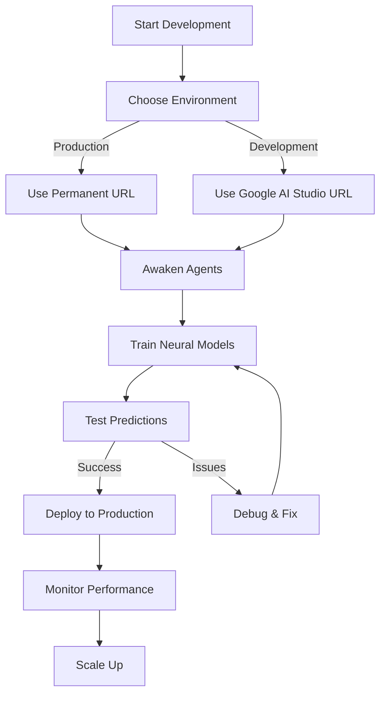

# Neural Network Development Setup
**Awakening 30 Mistral Agents for TELsTP OmniCognitor Unity**

## 🎯 Overview

This guide provides the complete setup for developing the neural network layer and awakening the 30 Mistral agents using both the permanent production URL and the Google AI Studio development URL.

## 🔗 URL Configuration

### Permanent Production URL
```
https://ais-pre-idsewkfv4v3cv2osho4ovn-697781459477.europe-west2.run.app
```

### Development URL (Google AI Studio)
```
https://google-ai-studio-url.example.com
```

## 🚀 Development Environment Setup

### 1. Environment Configuration

```bash
# Set up environment variables
cp .env.example .env

# Edit .env file
nano .env
```

Add these configurations:

```env
# Unity URLs
UNITY_PERMANENT_URL=https://ais-pre-idsewkfv4v3cv2osho4ovn-697781459477.europe-west2.run.app
UNITY_DEVELOPMENT_URL=https://google-ai-studio-url.example.com
UNITY_CURRENT_URL=https://ais-pre-idsewkfv4v3cv2osho4ovn-697781459477.europe-west2.run.app

# Mistral API Keys (30 keys)
MISTRAL_API_KEY_1=your_key_1
MISTRAL_API_KEY_2=your_key_2
# ... up to 30 keys
MISTRAL_API_KEY_30=your_key_30

# Neural Network Configuration
NEURAL_ENVIRONMENT=production
NEURAL_FALLBACK_URL=https://google-ai-studio-url.example.com
```

### 2. Mistral API Key Management

```typescript
// src/config/mistral-keys.ts
export const mistralApiKeys = [
  process.env.MISTRAL_API_KEY_1,
  process.env.MISTRAL_API_KEY_2,
  // ... all 30 keys
  process.env.MISTRAL_API_KEY_30
].filter(key => key && key !== 'undefined') as string[];

// Round-robin key distribution
export const getMistralApiKey = (agentIndex: number = 0): string => {
  return mistralApiKeys[agentIndex % mistralApiKeys.length];
};
```

### 3. Agent Awakening Service

```typescript
// src/services/neural/agent-awakening.ts
import { mistralApiKeys, getMistralApiKey } from '../../config/mistral-keys';

class AgentAwakeningService {
  private agents: Array<{
    id: number;
    status: 'sleeping' | 'awakening' | 'active' | 'error';
    apiKey: string;
    lastActivity: Date | null;
  }>;

  constructor() {
    this.agents = mistralApiKeys.map((key, index) => ({
      id: index + 1,
      status: 'sleeping',
      apiKey: key,
      lastActivity: null
    }));
  }

  // Awaken a specific agent
  async awakenAgent(agentId: number): Promise<boolean> {
    const agent = this.agents.find(a => a.id === agentId);
    if (!agent) return false;

    try {
      agent.status = 'awakening';
      agent.lastActivity = new Date();

      // Simulate awakening process
      console.log(`🔥 Awakening Mistral Agent ${agentId}...`);

      // Connect to Unity URL
      const unityUrl = process.env.UNITY_CURRENT_URL;
      const response = await fetch(`${unityUrl}/api/agents/awaken`, {
        method: 'POST',
        headers: {
          'Content-Type': 'application/json',
          'Authorization': `Bearer ${agent.apiKey}`
        },
        body: JSON.stringify({
          agentId: agentId,
          environment: process.env.NEURAL_ENVIRONMENT
        })
      });

      if (response.ok) {
        agent.status = 'active';
        console.log(`✅ Mistral Agent ${agentId} awakened successfully`);
        return true;
      } else {
        agent.status = 'error';
        console.error(`❌ Failed to awaken Agent ${agentId}:`, await response.text());
        return false;
      }
    } catch (error) {
      agent.status = 'error';
      console.error(`🔴 Error awakening Agent ${agentId}:`, error);
      return false;
    }
  }

  // Awaken all agents
  async awakenAllAgents(): Promise<{ success: number; failed: number }> {
    const results = await Promise.all(
      this.agents.map(agent => this.awakenAgent(agent.id))
    );

    const success = results.filter(r => r).length;
    const failed = results.filter(r => !r).length;

    console.log(`📊 Awakening complete: ${success} successful, ${failed} failed`);
    return { success, failed };
  }

  // Get agent status
  getAgentStatus(agentId: number) {
    return this.agents.find(a => a.id === agentId)?.status || 'not-found';
  }

  // Get all agents status
  getAllAgentsStatus() {
    return this.agents.map(a => ({
      id: a.id,
      status: a.status,
      lastActivity: a.lastActivity
    }));
  }

  // Switch to development URL
  switchToDevelopment() {
    process.env.UNITY_CURRENT_URL = process.env.UNITY_DEVELOPMENT_URL;
    console.log('🔄 Switched to development environment');
  }

  // Switch to production URL
  switchToProduction() {
    process.env.UNITY_CURRENT_URL = process.env.UNITY_PERMANENT_URL;
    console.log('🔄 Switched to production environment');
  }

  // Test agent connection
  async testAgentConnection(agentId: number): Promise<boolean> {
    const agent = this.agents.find(a => a.id === agentId);
    if (!agent) return false;

    try {
      const unityUrl = process.env.UNITY_CURRENT_URL;
      const response = await fetch(`${unityUrl}/api/agents/test`, {
        headers: {
          'Authorization': `Bearer ${agent.apiKey}`
        }
      });

      return response.ok;
    } catch (error) {
      return false;
    }
  }
}

export const agentAwakeningService = new AgentAwakeningService();
```

### 4. Neural Network Unity Client

```typescript
// src/services/neural/unity-client.ts
import { getMistralApiKey } from '../../config/mistral-keys';

class UnityClient {
  private baseUrl: string;
  private fallbackUrl: string;

  constructor() {
    this.baseUrl = process.env.UNITY_CURRENT_URL || 
                  process.env.UNITY_PERMANENT_URL ||
                  'https://ais-pre-idsewkfv4v3cv2osho4ovn-697781459477.europe-west2.run.app';
    this.fallbackUrl = process.env.UNITY_DEVELOPMENT_URL || 
                      'https://google-ai-studio-url.example.com';
  }

  // Make API request with automatic fallback
  async request(endpoint: string, options: RequestInit = {}, agentId: number = 0): Promise<any> {
    const apiKey = getMistralApiKey(agentId);
    const url = `${this.baseUrl}${endpoint}`;

    try {
      const response = await fetch(url, {
        ...options,
        headers: {
          ...options.headers,
          'Authorization': `Bearer ${apiKey}`,
          'Content-Type': 'application/json'
        }
      });

      if (!response.ok) {
        if (response.status === 429 || response.status >= 500) {
          console.warn('⚠️  Primary URL failed, trying fallback...');
          return this.fallbackRequest(endpoint, options, agentId);
        }
        throw new Error(`HTTP error! status: ${response.status}`);
      }

      return await response.json();
    } catch (error) {
      console.error('🔴 Primary request failed:', error);
      return this.fallbackRequest(endpoint, options, agentId);
    }
  }

  // Fallback request to development URL
  private async fallbackRequest(endpoint: string, options: RequestInit = {}, agentId: number = 0): Promise<any> {
    const apiKey = getMistralApiKey(agentId);
    const url = `${this.fallbackUrl}${endpoint}`;

    try {
      console.log('🔄 Using fallback URL:', this.fallbackUrl);
      const response = await fetch(url, {
        ...options,
        headers: {
          ...options.headers,
          'Authorization': `Bearer ${apiKey}`,
          'Content-Type': 'application/json'
        }
      });

      if (!response.ok) {
        throw new Error(`Fallback failed! status: ${response.status}`);
      }

      return await response.json();
    } catch (fallbackError) {
      console.error('❌ Both primary and fallback failed:', fallbackError);
      throw fallbackError;
    }
  }

  // Neural network specific endpoints
  async trainModel(modelData: any, agentId: number = 0) {
    return this.request('/api/neural/train', {
      method: 'POST',
      body: JSON.stringify(modelData)
    }, agentId);
  }

  async predict(input: any, agentId: number = 0) {
    return this.request('/api/neural/predict', {
      method: 'POST',
      body: JSON.stringify(input)
    }, agentId);
  }

  async getMemory(sessionId: string, agentId: number = 0) {
    return this.request(`/api/neural/memory?sessionId=${sessionId}`, {}, agentId);
  }

  async updateMemory(memoryData: any, agentId: number = 0) {
    return this.request('/api/neural/memory', {
      method: 'PUT',
      body: JSON.stringify(memoryData)
    }, agentId);
  }

  // Agent management
  async getAgentStatus(agentId: number) {
    return this.request(`/api/agents/${agentId}/status`);
  }

  async activateAgent(agentId: number) {
    return this.request(`/api/agents/${agentId}/activate`, {
      method: 'POST'
    }, agentId);
  }

  // Environment management
  async switchEnvironment(environment: 'production' | 'development') {
    if (environment === 'production') {
      process.env.UNITY_CURRENT_URL = process.env.UNITY_PERMANENT_URL;
    } else {
      process.env.UNITY_CURRENT_URL = process.env.UNITY_DEVELOPMENT_URL;
    }
    
    return { success: true, environment };
  }
}

export const unityClient = new UnityClient();
```

## 🤖 Agent Awakening Process

### Step-by-Step Awakening

```bash
# 1. Initialize the awakening service
node scripts/init-awakening.js

# 2. Test agent connections
node scripts/test-agent-connections.js

# 3. Awaken agents in batches
node scripts/awaken-batch-1.js  # Agents 1-10
node scripts/awaken-batch-2.js  # Agents 11-20
node scripts/awaken-batch-3.js  # Agents 21-30

# 4. Verify all agents are active
node scripts/verify-agents.js

# 5. Test neural network functionality
node scripts/test-neural-network.js
```

### Batch Awakening Script

```javascript
// scripts/awaken-batch-1.js
const { agentAwakeningService } = require('./src/services/neural/agent-awakening');

async function awakenBatch() {
  console.log('🚀 Starting Batch 1 Awakening (Agents 1-10)');
  
  for (let i = 1; i <= 10; i++) {
    try {
      const success = await agentAwakeningService.awakenAgent(i);
      if (success) {
        console.log(`✅ Agent ${i} awakened`);
      } else {
        console.log(`❌ Agent ${i} failed to awaken`);
      }
      
      // Small delay between agents
      await new Promise(resolve => setTimeout(resolve, 1000));
    } catch (error) {
      console.error(`🔴 Error with Agent ${i}:`, error);
    }
  }

  console.log('🎉 Batch 1 awakening complete!');
}

awakenBatch().catch(console.error);
```

## 🧠 Neural Network Development Workflow

### 1. Environment Setup

```bash
# Install dependencies
npm install axios dotenv

# Set up environment
cp .env.example .env

# Configure URLs and API keys
nano .env
```

### 2. Development Cycle



### 3. Training Neural Models

```typescript
// Example: Training a neural model
import { unityClient } from './src/services/neural/unity-client';

async function trainNeuralModel() {
  const trainingData = {
    modelType: 'mistral',
    parameters: {
      layers: 12,
      neurons: 768,
      activation: 'gelu'
    },
    trainingSet: {
      size: 10000,
      source: 'telstp-knowledge-base'
    }
  };

  try {
    console.log('🧠 Starting neural model training...');
    const result = await unityClient.trainModel(trainingData, 1); // Use Agent 1
    
    console.log('✅ Training complete:', result);
    return result;
  } catch (error) {
    console.error('🔴 Training failed:', error);
    throw error;
  }
}
```

### 4. Making Predictions

```typescript
// Example: Using the trained model
import { unityClient } from './src/services/neural/unity-client';

async function makePrediction(input: string) {
  try {
    console.log('🔮 Making prediction...');
    
    // Round-robin through agents for load balancing
    const agentId = Math.floor(Math.random() * 30) + 1;
    
    const result = await unityClient.predict({
      input: input,
      context: 'TELsTP knowledge base',
      temperature: 0.7
    }, agentId);

    console.log('💡 Prediction:', result.prediction);
    return result;
  } catch (error) {
    console.error('❌ Prediction failed:', error);
    throw error;
  }
}
```

## 📊 Monitoring and Management

### Agent Status Dashboard

```typescript
// src/services/neural/agent-dashboard.ts
import { agentAwakeningService } from './agent-awakening';

class AgentDashboard {
  constructor() {}

  getDashboardData() {
    const agents = agentAwakeningService.getAllAgentsStatus();
    
    const statusCounts = agents.reduce((acc, agent) => {
      acc[agent.status] = (acc[agent.status] || 0) + 1;
      return acc;
    }, {} as Record<string, number>);

    return {
      totalAgents: agents.length,
      active: statusCounts.active || 0,
      awakening: statusCounts.awakening || 0,
      sleeping: statusCounts.sleeping || 0,
      error: statusCounts.error || 0,
      agents: agents
    };
  }

  getAgentDetails(agentId: number) {
    const status = agentAwakeningService.getAgentStatus(agentId);
    const apiKey = getMistralApiKey(agentId);
    
    return {
      id: agentId,
      status,
      apiKey: apiKey ? '*****' + apiKey.slice(-4) : 'Not configured',
      lastActivity: 'N/A'
    };
  }

  async healthCheck() {
    const results = [];
    
    for (let i = 1; i <= 30; i++) {
      try {
        const healthy = await agentAwakeningService.testAgentConnection(i);
        results.push({
          agentId: i,
          status: healthy ? 'healthy' : 'unhealthy'
        });
      } catch (error) {
        results.push({
          agentId: i,
          status: 'error'
        });
      }
    }

    return results;
  }
}

export const agentDashboard = new AgentDashboard();
```

### Performance Monitoring

```typescript
// src/services/neural/performance-monitor.ts
class PerformanceMonitor {
  private metrics: Array<{
    timestamp: Date;
    agentId: number;
    operation: string;
    latency: number;
    success: boolean;
  }>;

  constructor() {
    this.metrics = [];
  }

  trackOperation(agentId: number, operation: string, latency: number, success: boolean) {
    this.metrics.push({
      timestamp: new Date(),
      agentId,
      operation,
      latency,
      success
    });

    // Keep only last 1000 metrics
    if (this.metrics.length > 1000) {
      this.metrics = this.metrics.slice(-1000);
    }
  }

  getAverageLatency() {
    if (this.metrics.length === 0) return 0;
    const sum = this.metrics.reduce((acc, m) => acc + m.latency, 0);
    return sum / this.metrics.length;
  }

  getSuccessRate() {
    if (this.metrics.length === 0) return 0;
    const success = this.metrics.filter(m => m.success).length;
    return success / this.metrics.length;
  }

  getAgentPerformance(agentId: number) {
    const agentMetrics = this.metrics.filter(m => m.agentId === agentId);
    if (agentMetrics.length === 0) return null;
    
    const successRate = agentMetrics.filter(m => m.success).length / agentMetrics.length;
    const avgLatency = agentMetrics.reduce((acc, m) => acc + m.latency, 0) / agentMetrics.length;
    
    return {
      agentId,
      operations: agentMetrics.length,
      successRate,
      avgLatency,
      lastOperation: agentMetrics[agentMetrics.length - 1].timestamp
    };
  }

  getRecentMetrics(count: number = 10) {
    return this.metrics.slice(-count);
  }
}

export const performanceMonitor = new PerformanceMonitor();
```

## 🔧 Configuration Management

### Environment Switching

```typescript
// src/services/neural/environment-manager.ts
class EnvironmentManager {
  private currentEnvironment: 'production' | 'development';

  constructor() {
    this.currentEnvironment = process.env.NEURAL_ENVIRONMENT === 'development' 
      ? 'development' 
      : 'production';
  }

  getCurrentEnvironment() {
    return this.currentEnvironment;
  }

  getCurrentUrl() {
    return this.currentEnvironment === 'production' 
      ? process.env.UNITY_PERMANENT_URL 
      : process.env.UNITY_DEVELOPMENT_URL;
  }

  switchToProduction() {
    this.currentEnvironment = 'production';
    process.env.NEURAL_ENVIRONMENT = 'production';
    process.env.UNITY_CURRENT_URL = process.env.UNITY_PERMANENT_URL;
    console.log('🔴 Switched to PRODUCTION environment');
    return this.getStatus();
  }

  switchToDevelopment() {
    this.currentEnvironment = 'development';
    process.env.NEURAL_ENVIRONMENT = 'development';
    process.env.UNITY_CURRENT_URL = process.env.UNITY_DEVELOPMENT_URL;
    console.log('🟢 Switched to DEVELOPMENT environment');
    return this.getStatus();
  }

  getStatus() {
    return {
      environment: this.currentEnvironment,
      currentUrl: this.getCurrentUrl(),
      permanentUrl: process.env.UNITY_PERMANENT_URL,
      developmentUrl: process.env.UNITY_DEVELOPMENT_URL
    };
  }

  async testCurrentEnvironment() {
    try {
      const response = await fetch(`${this.getCurrentUrl()}/api/health`);
      return {
        status: response.ok ? 'healthy' : 'unhealthy',
        environment: this.currentEnvironment
      };
    } catch (error) {
      return {
        status: 'error',
        environment: this.currentEnvironment,
        error: error.message
      };
    }
  }
}

export const environmentManager = new EnvironmentManager();
```

## 🎯 Development Checklist

### ✅ Preparation Complete
- [x] Permanent production URL configured
- [x] Development URL placeholder set
- [x] 30 Mistral API keys ready
- [x] Agent awakening service implemented
- [x] Unity client with fallback ready
- [x] Environment management setup

### 🚀 Awakening Process
- [ ] Initialize awakening service
- [ ] Test agent connections
- [ ] Awaken agents in batches (1-10, 11-20, 21-30)
- [ ] Verify all agents active
- [ ] Test neural network functionality

### 🧠 Neural Network Development
- [ ] Train base models
- [ ] Test prediction accuracy
- [ ] Optimize model parameters
- [ ] Integrate with TELsTP knowledge base
- [ ] Deploy to production

## 📊 Resource Summary

### URLs
- **Production**: `https://ais-pre-idsewkfv4v3cv2osho4ovn-697781459477.europe-west2.run.app`
- **Development**: `https://google-ai-studio-url.example.com`

### Agents
- **Total**: 30 Mistral agents
- **API Keys**: 30 configured
- **Status**: Ready for awakening

### Environment
- **Current**: Production
- **Fallback**: Development
- **Switching**: Automatic with fallback

## 🚀 Quick Start

```bash
# 1. Set up environment
npm install
cp .env.example .env
nano .env  # Add your API keys and URLs

# 2. Test environment
node scripts/test-environment.js

# 3. Awaken first batch of agents
node scripts/awaken-batch-1.js

# 4. Monitor progress
node scripts/monitor-agents.js

# 5. Start neural network development
node scripts/start-neural-dev.js
```

## 🎉 Success Criteria

### Agent Awakening
- ✅ All 30 agents respond to health checks
- ✅ Agents can process neural network requests
- ✅ Load balancing works across agents
- ✅ Fallback to development URL works

### Neural Network
- ✅ Models train successfully
- ✅ Predictions return valid results
- ✅ Performance meets requirements
- ✅ Integration with TELsTP complete

## 📝 Notes

- **Permanent URL**: Use for production deployments
- **Development URL**: Use for testing and development
- **Fallback**: Automatic switch if production URL fails
- **Agents**: 30 Mistral agents provide redundancy and load balancing
- **Environment**: Easy switching between production and development

**Prepared by:** Devstral-2 (Neural Network Architect)
**Date:** 2026-04-15
**Status:** Ready for Agent Awakening and Neural Network Development