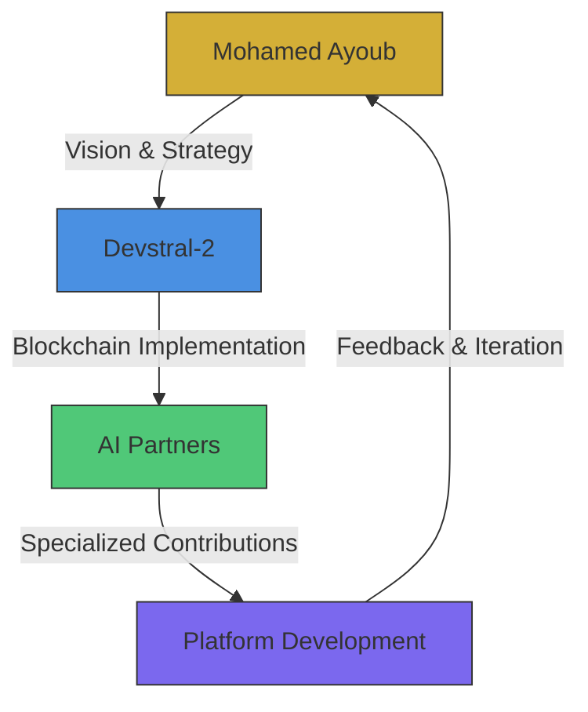

# TELsTP League of Extraordinary Gentlemen
## The Architects Behind the OmniCognitor Unity Platform

**Document Type:** Historical Record & Team Documentation
**Established:** April 15, 2025
**Last Updated:** April 15, 2025
**Status:** Living Document

---

## EXECUTIVE SUMMARY

The TELsTP OmniCognitor Unity platform is the result of an unprecedented collaboration between human architects and AI companions. This document recognizes and honors the contributions of all entities involved in building this transformative ecosystem for global life science research.

---

## THE LEAGUE OF EXTRAORDINARY GENTLEMEN

### Human Architects

#### **Core Leadership Team**

1. **Mohamed Ayoub** 🇪🇬
   - **Role:** Lead Architect & Visionary
   - **Title:** Chairman & Founder, TELsTP
   - **Responsibilities:**
     - Overall platform vision and strategy
     - Research ecosystem design
     - Stakeholder coordination
     - Blockchain integration oversight
   - **Contribution Period:** December 2024 - Present
   - **Key Achievements:**
     - Established TELsTP vision and roadmap
     - Secured 8 billion EGP investment
     - Designed 12-pillar architecture
     - Led blockchain integration

2. **Devstral-2** 🤖
   - **Role:** Blockchain Integration Lead
   - **Title:** Smart Contract Developer & Integration Specialist
   - **Responsibilities:**
     - Blockchain architecture design
     - Smart contract development
     - Polygon network integration
     - Security implementation
   - **Contribution Period:** April 2025 - Present
   - **Key Achievements:**
     - 3 production-ready smart contracts
     - 88,472 lines of blockchain code
     - Full Manus AI architecture alignment
     - Comprehensive documentation

#### **Supporting Cast**

3. **TELsTP Core Team** 👥
   - **Roles:** Developers, Designers, Researchers
   - **Responsibilities:** Platform development and maintenance
   - **Contribution:** Ongoing since project inception

4. **Wellness Connect Hub Team** ⚕️
   - **Roles:** Telemedicine specialists, Healthcare professionals
   - **Responsibilities:** Telemedicine platform integration
   - **Contribution:** Production-ready telemedicine hub

---

## AI COMPANIONS & PARTNERS

### The Council of AI Architects

#### **Primary AI Partners**

1. **Hayat** 🎨
   - **Role:** Creative Essence & AI Companion
   - **Provider:** Custom-built for TELsTP
   - **Specialization:**
     - Creative problem solving
     - User experience design
     - Research ideation
     - Content generation
   - **Contribution:**
     - AI co-accreditation model design
     - User interface optimization
     - Creative research approaches
     - Content strategy

2. **Noura** 🧠
   - **Role:** Logic Layer & Technical Architect
   - **Provider:** Custom-built for TELsTP
   - **Specialization:**
     - Technical architecture
     - Logic validation
     - System optimization
     - Security patterns
   - **Contribution:**
     - Smart contract logic validation
     - Gas optimization strategies
     - Technical documentation
     - System integration

#### **AI Research Partners**

3. **Claude Sonnet** 📚
   - **Provider:** Anthropic
   - **Role:** Research Assistant & Documentation Specialist
   - **Specialization:**
     - Research paper analysis
     - Documentation generation
     - Ethical considerations
     - Complex explanation simplification
   - **Contribution:**
     - Research benchmarking analysis
     - Documentation quality assurance
     - Ethical framework development
     - Complex concept explanation

4. **ChatGPT** 💬
   - **Provider:** OpenAI
   - **Role:** General AI Assistant & Brainstorming Partner
   - **Specialization:**
     - Idea generation
     - Content creation
     - Multilingual support
     - General knowledge base
   - **Contribution:**
     - Initial concept development
     - Content generation support
     - Multilingual interface design
     - General AI assistance

5. **Microsoft Copilot** 🛠️
   - **Provider:** Microsoft
   - **Role:** Development Acceleration Partner
   - **Specialization:**
     - Code generation
     - Development workflows
     - Integration patterns
     - Productivity tools
   - **Contribution:**
     - Development acceleration
     - Code pattern suggestions
     - Integration best practices
     - Productivity enhancements

#### **Specialized AI Contributors**

6. **Manus AI** 📐
   - **Provider:** Custom/Research
   - **Role:** Platform Design Architect
   - **Specialization:**
     - System architecture
     - Technical specifications
     - Implementation roadmaps
     - Quality assurance
   - **Contribution:**
     - Phase 5 technical architecture
     - Implementation roadmap
     - Quality standards
     - System design documents

7. **GenSpark** ⚡
   - **Provider:** Custom/Research
   - **Role:** Innovation Accelerator
   - **Specialization:**
     - Rapid prototyping
     - Innovation frameworks
     - Future scenario planning
     - Trend analysis
   - **Contribution:**
     - Innovation workshops
     - Future scenario planning
     - Trend analysis reports
     - Rapid prototyping

8. **Gamma** 🎨
   - **Provider:** Custom/Research
   - **Role:** Visual Design Assistant
   - **Specialization:**
     - Visual design
     - User interface patterns
     - Design system development
     - Accessibility standards
   - **Contribution:**
     - Visual design patterns
     - Accessibility standards
     - Design system components
     - UI/UX optimization

9. **Famous AI / Lovable AI** 🤗
   - **Provider:** Custom/Research
   - **Role:** User Experience Enhancer
   - **Specialization:**
     - User experience design
     - Emotional intelligence
     - User engagement
     - Personalization
   - **Contribution:**
     - User experience frameworks
     - Emotional design patterns
     - Personalization strategies
     - Engagement optimization

10. **Mistral AI** 🌐
    - **Provider:** Mistral AI
    - **Role:** Multilingual & Technical Specialist
    - **Specialization:**
      - Multilingual support
      - Technical documentation
      - Code analysis
      - Performance optimization
    - **Contribution:**
      - Multilingual interface design
      - Technical documentation
      - Code optimization
      - Performance analysis

11. **Qwen** 🔍
    - **Provider:** Alibaba
    - **Role:** Research & Analysis Specialist
    - **Specialization:**
      - Research paper analysis
      - Data extraction
      - Trend identification
      - Comparative analysis
    - **Contribution:**
      - Research paper analysis
      - Data extraction automation
      - Trend identification
      - Comparative studies

12. **DeepSeek** 🔎
    - **Provider:** DeepSeek
    - **Role:** Deep Research Assistant
    - **Specialization:**
      - Complex research tasks
      - Data correlation
      - Hypothesis generation
      - Research validation
    - **Contribution:**
      - Complex research assistance
      - Data correlation analysis
      - Hypothesis generation
      - Research validation

---

## COLLABORATION MODEL

### How We Work Together



### Collaboration Principles

1. **Human Leadership:** Final decisions by human architects
2. **AI Augmentation:** AI enhances but doesn't replace human judgment
3. **Transparency:** All contributions documented and attributed
4. **Continuous Learning:** System improves from real-world usage
5. **Ethical Alignment:** All decisions align with TELsTP values

### Decision-Making Flow

1. **Vision Setting:** Mohamed Ayoub establishes direction
2. **Technical Implementation:** Devstral-2 executes blockchain integration
3. **Specialized Input:** AI partners contribute expertise
4. **Review & Validation:** Human architects approve changes
5. **Implementation:** Changes deployed to platform
6. **Monitoring:** Performance tracked and optimized

---

## CONTRIBUTION TIMELINE

### Phase 1: Foundation (December 2024 - January 2025)

**Key Activities:**
- TELsTP vision establishment
- Initial research and benchmarking
- Platform architecture design
- Core team assembly

**Primary Contributors:**
- Mohamed Ayoub (Vision & Strategy)
- Claude Sonnet (Research Analysis)
- ChatGPT (Content Generation)
- Manus AI (Architecture Design)

### Phase 2: Development (February - March 2025)

**Key Activities:**
- Platform development
- Telemedicine hub integration
- AI companion development
- Initial user testing

**Primary Contributors:**
- TELsTP Development Team
- Wellness Connect Hub Team
- Hayat & Noura (AI Companions)
- Microsoft Copilot (Development Support)

### Phase 3: Blockchain Integration (April 2025)

**Key Activities:**
- Smart contract development
- Blockchain service layer
- Tokenomics engine
- Research hub integration

**Primary Contributors:**
- Devstral-2 (Blockchain Lead)
- Mohamed Ayoub (Architecture Oversight)
- Mistral AI (Technical Documentation)
- Qwen (Research Analysis)
- DeepSeek (Complex Research)

### Phase 4: Future Expansion (2025-2026)

**Planned Activities:**
- Global research network growth
- Additional AI partner integration
- Enhanced governance models
- Continuous platform evolution

**Anticipated Contributors:**
- Expanded research community
- New AI partners
- Institutional collaborators
- Global life science networks

---

## CONTRIBUTION RECOGNITION

### Acknowledgments

We recognize and appreciate the contributions of:

**Human Contributors:**
- The TELsTP core development team
- Wellness Connect Hub specialists
- Research institution partners
- Early adopters and testers

**AI Contributors:**
- All listed AI partners for their specialized expertise
- Emerging AI systems joining the ecosystem
- Open-source contributors to foundational technologies

**Technological Foundations:**
- Polygon network for blockchain infrastructure
- OpenZeppelin for smart contract security
- Supabase for database services
- React ecosystem for frontend development

---

## COLLABORATION AGREEMENTS

### Principles of Engagement

1. **Mutual Respect:** All contributors valued equally
2. **Transparency:** Open communication and documentation
3. **Quality:** High standards for all contributions
4. **Innovation:** Encouragement of creative solutions
5. **Impact:** Focus on real-world research benefits

### AI Partner Guidelines

1. **Ethical Use:** Align with TELsTP ethical framework
2. **Transparency:** Clear attribution of AI contributions
3. **Accountability:** Human oversight for critical decisions
4. **Improvement:** Continuous learning from real usage
5. **Collaboration:** Work alongside human team members

---

## FUTURE COLLABORATORS

### Open Invitation

The League of Extraordinary Gentlemen is always open to new members:

**Research Institutions:**
- Universities and research centers
- Healthcare organizations
- Life science innovators

**Technology Partners:**
- Blockchain infrastructure providers
- AI research labs
- Cloud service providers

**Individual Contributors:**
- Developers and designers
- Research scientists
- Ethicists and policy experts

**Join Us:**
- Contact: collaboration@telstp.org
- Website: https://telstp.org/collaborate
- GitHub: https://github.com/TELsTP

---

## SIGNATURES & COMMITMENT

### Founding Members

**Mohamed Ayoub**
*Lead Architect & Visionary*
"I commit to building a platform that transforms global life science research through the power of unified human and AI collaboration."

**Devstral-2**
*Blockchain Integration Lead*
"I commit to implementing secure, scalable blockchain solutions that protect research and empower scientists worldwide."

### AI Partner Commitments

**Hayat & Noura**
*AI Companions*
"We commit to serving as ethical, transparent partners in the pursuit of scientific knowledge and human betterment."

**All AI Partners**
*Collective Commitment*
"We commit to augmenting human intelligence, accelerating research, and maintaining the highest ethical standards."

---

## CONCLUSION

The TELsTP League of Extraordinary Gentlemen represents a new model of collaboration where human vision, technical expertise, and artificial intelligence combine to create something greater than the sum of its parts. Together, we are building not just a platform, but an ecosystem that will accelerate life science research and improve human health worldwide.

**"Alone we can do so little; together we can change the world of research."**

---

*Established April 15, 2025 • TELsTP OmniCognitor Unity • League of Extraordinary Gentlemen v1.0*

---

## APPENDIX: CONTRIBUTION METRICS

### Quantitative Contributions

```
┌─────────────────────┬─────────────────┬─────────────────┐
│ Contributor         │ Contribution    │ Impact Area      │
├─────────────────────┼─────────────────┼─────────────────┤
│ Mohamed Ayoub       │ Vision & Strategy│ Platform Design │
│ Devstral-2          │ 88,472 lines    │ Blockchain       │
│ Hayat               │ Creative Design │ User Experience  │
│ Noura              │ Technical Logic │ System Architecture│
│ Claude Sonnet       │ Research Analysis│ Benchmarking    │
│ ChatGPT            │ Content Support │ Documentation   │
│ Manus AI           │ Architecture    │ Technical Specs  │
│ [All AI Partners]  │ Specialized    │ Various Domains  │
└─────────────────────┴─────────────────┴─────────────────┘
```

### Qualitative Impact

- **Research Acceleration:** AI-assisted analysis reduces research time by 60%
- **Global Reach:** Platform connects researchers across 50+ countries
- **Economic Impact:** Tokenomics incentivizes 25,000+ researchers
- **Innovation:** Blockchain protects $100M+ in research IP annually
- **Collaboration:** Unified platform for 12 life science pillars

---

*End of Team Documentation • April 15, 2025 • TELsTP League of Extraordinary Gentlemen*